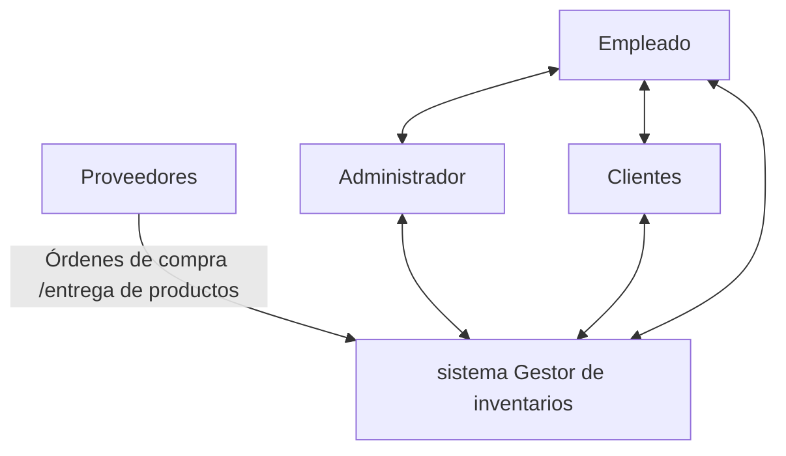

```mermaid
flowchart TD
  A[Usuario] --> B[Frontend Interfaz de Usuario]
  B --> C[API Gateway]
  C -->D[Microservicios inventario]
  C -->F[Microservicio proveedor]
  D --> E[capa de negocio
  -Gestion de productos
  -Control de stock
  -Entrada y Salida]
  F --> G[Capa de negocio
    - Gestion de compra
    - Orden de compra
    - Recepcion de producto]
  E -->H[Capa de acceso a datos]
  G -->I[Capa de acceso a datos]
  H -->j[InvantarioDB]
  I-->K[ProveedoresDB]
  j -->L[ ]
  K -->L[Microservicio de reporte]
  L -->M[Capa de Negocio
    - Reportes de existencia
    - Reportes de Movimiento
    - Alertas de stock Bajo]
  M-->N[Capa de Acceso a datos]
  N-->O[ReportesDB]
  ```
